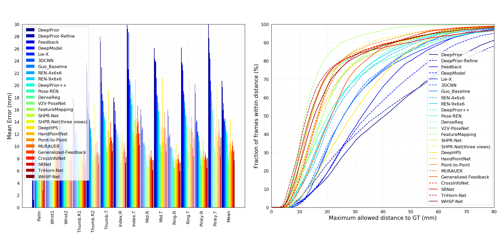
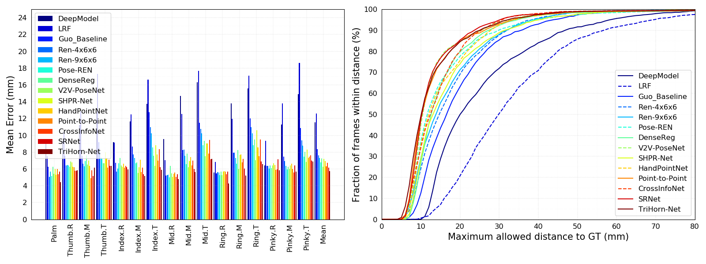

# Evaluations on hand pose estimation

## Description
This project provides codes to evaluate performances of hand pose estimation on several public datasets, including [NYU](http://cims.nyu.edu/~tompson/NYU_Hand_Pose_Dataset.htm), [ICVL](http://www.iis.ee.ic.ac.uk/~dtang/hand.html), [MSRA](https://jimmysuen.github.io/) hand pose dataset. We collect predicted labels of some prior works **_which are available online_** and visualize the performances.

## Evaluation metric
There are two types of evaluation metrics that are widely used for hand pose estimation:

(1) Mean error for each joint

(2) Success rate:
 - The proportion of test frames whose average error falls below a threshold
 - The proportion of test frames whose maximum error falls below a threshold
 - The proportion of all joints whose error falls below a threshold

## Methods and corresponding predicted labels
### ICVL
- LRF \[1\]: CVPR'14, [Predicted labels](http://www.iis.ee.ic.ac.uk/~dtang/dataset/Results.tar.gz)
- DeepModel \[2\]: IJCAI'16, [Predicted labels](http://xingyizhou.xyz/IJCAI16_ICVL.txt)
- Guo-Baseline \[3\]: ICIP'17, [Predicted labels](https://github.com/guohengkai/region-ensemble-network/blob/master/results/icvl_basic.txt)
- REN-4x6x6 \[3\]: ICIP'17, [Predicted labels](https://github.com/guohengkai/region-ensemble-network/blob/master/results/icvl_ren_4x6x6.txt)
- REN-9x6x6 \[7\]: arXiv'17, [Predicted labels](https://github.com/guohengkai/region-ensemble-network/blob/master/results/icvl_ren_9x6x6.txt)
- Pose-REN \[8\]: arXiv'17, [Predicted labels](https://github.com/xinghaochen/awesome-hand-pose-estimation/tree/master/evaluation/results/icvl/arXiv17_ICVL_Pose_REN.txt)
- DenseReg \[10\]: arXiv'17, [Predicted labels](https://github.com/melonwan/denseReg/blob/master/exp/result/icvl.txt)

### NYU
- DeepPrior \[4\]: CVWW'15, [Predicted labels](https://www.tugraz.at/fileadmin/user_upload/Institute/ICG/Downloads/team_lepetit/3d_hand_pose/CVWW15_ICVL_Prior.txt)
- DeepPrior-Refinement \[4\]: CVWW'15, [Predicted labels](https://www.tugraz.at/fileadmin/user_upload/Institute/ICG/Downloads/team_lepetit/3d_hand_pose/CVWW15_ICVL_Prior-Refinement.txt)
- Feedback \[5\]: CVPR'15, [Predicted labels](https://www.tugraz.at/fileadmin/user_upload/Institute/ICG/Downloads/team_lepetit/3d_hand_pose/ICCV15_NYU_Feedback.txt)
- DeepModel \[2\]: IJCAI'16, [Predicted labels](http://xingyizhou.xyz/IJCAI16_NYU.txt)
- Lie-X \[6\]: IJCV'16, [Predicted labels](https://web.bii.a-star.edu.sg/~xuchi/Lie-X/lie_hand_jnts_estm_result.txt)
- Guo-Baseline \[3\]: ICIP'17, [Predicted labels](https://github.com/guohengkai/region-ensemble-network/blob/master/results/nyu_basic.txt)
- REN-4x6x6 \[3\]: ICIP'17, [Predicted labels](https://github.com/guohengkai/region-ensemble-network/blob/master/results/nyu_ren_4x6x6.txt)
- REN-9x6x6 \[7\]: arXiv'17, [Predicted labels](https://github.com/guohengkai/region-ensemble-network/blob/master/results/nyu_ren_9x6x6.txt)
- Pose-REN \[8\]: arXiv'17, [Predicted labels](https://github.com/xinghaochen/awesome-hand-pose-estimation/tree/master/evaluation/results/nyu/arXiv17_NYU_Pose_REN.txt)
- DeepPrior++ \[9\]: ICCVW'17, [Predicted labels](https://www.tugraz.at/fileadmin/user_upload/Institute/ICG/Downloads/team_lepetit/3d_hand_pose/ICCVW17_NYU_DeepPrior__.txt)
- DenseReg \[10\]: arXiv'17, [Predicted labels](https://github.com/melonwan/denseReg/blob/master/exp/result/nyu.txt)

### MSRA
- REN-9x6x6 \[7\]: arXiv'17, [Predicted labels](https://github.com/guohengkai/region-ensemble-network/blob/master/results/msra_ren_9x6x6.txt)
- Pose-REN \[8\]: arXiv'17, [Predicted labels](https://github.com/xinghaochen/awesome-hand-pose-estimation/tree/master/evaluation/results/msra/arXiv17_MSRA_Pose_REN.txt)
- DenseReg \[10\]: arXiv'17, [Predicted labels](https://github.com/melonwan/denseReg/blob/master/exp/result/msra.txt)

### Notes
Note that only 14 out of 36 joints are used for evaluation and we use the joints with id [0, 3, 6, 9, 12, 15, 18, 21, 24, 25, 27, 30, 31, 32]. All labels are in the format of (u, v, d) where u and v are pixel coordinates.

For Lie-X, the original predicted labels are in format of (x, y, z) and the order of joints is different. We convert the labels from xyz to uvd and permute the order of joints to keep consistent with other methods (see src/convert_results_xyz2uvd_LieX.py).

For DenseReg, we convert the original predicted labels from xyz to uvd (see src/convert_results_xyz2uvd_denseReg.py).

## Usage
Use the python code to show the evaluation results:
```
python compute_error.py icvl/nyu/msra max-frame/mean-frame/joint method_names in_files
```
The first parameter indicates which dataset is being evaluated while the second one indicates which type of success rate that is listed above is being chosen. The following parameters specify the names of methods and their corresponding predict label files.

We provide easy-to-use bash scripts to display performances of some methods, just run the following command:
```
sh evaluate_{dataset}.sh
```
## Results
### Results on NYU dataset


### Results on ICVL dataset


### Results on MSRA dataset


## Reference
- \[1\] Tang, Danhang, et al. "[Latent regression forest: Structured estimation of 3d articulated hand posture.](http://www.iis.ee.ic.ac.uk/dtang/cvpr_14.pdf)" Proceedings of the IEEE Conference on Computer Vision and Pattern Recognition. 2014.
- \[2\] Zhou, Xingyi, et al. "[Model-based deep hand pose estimation.](http://xingyizhou.xyz/zhou2016model.pdf)" Proceedings of the Twenty-Fifth International Joint Conference on Artificial Intelligence. AAAI Press, 2016.
- \[3\] Guo, Hengkai, et al. "[Region Ensemble Network: Improving Convolutional Network for Hand Pose Estimation.](https://arxiv.org/pdf/1702.02447.pdf)" arXiv preprint arXiv:1702.02447 (2017).
- \[4\] Oberweger, Markus, Paul Wohlhart, and Vincent Lepetit. "[Hands deep in deep learning for hand pose estimation.](https://arxiv.org/pdf/1502.06807)" Computer Vision Winter Workshop, 2015.
- \[5\] Oberweger, Markus, Paul Wohlhart, and Vincent Lepetit. "[Training a feedback loop for hand pose estimation.](https://arxiv.org/pdf/1609.09698)" Proceedings of the IEEE International Conference on Computer Vision. 2015.
- \[6\] Xu, Chi, et al. "[Lie-X: Depth Image Based Articulated Object Pose Estimation, Tracking, and Action Recognition on Lie Groups.](https://arxiv.org/pdf/1609.03773)" International Journal of Computer Vision (2017): 1-25.
- \[7\] Guo, Hengkai, et al. "[Towards Good Practices for Deep 3D Hand Pose Estimation.](https://arxiv.org/pdf/1707.07248.pdf)" arXiv preprint arXiv:1707.07248 (2017).
- \[8\] Chen, Xinghao, et al. "[Pose Guided Structured Region Ensemble Network for Cascaded Hand Pose Estimation.](https://arxiv.org/pdf/1708.03416)" arXiv preprint arXiv:1708.03416 (2017).
- \[9\] Oberweger, Markus, et al. "[DeepPrior++: Improving Fast and Accurate 3D Hand Pose Estimation.](https://www.tugraz.at/fileadmin/user_upload/Institute/ICG/Images/team_lepetit/publications/oberweger_iccvw17.pdf)" ICCV Hands17 Workshop (2017).
- \[10\] Wan, Chengde, et al. "[Dense 3D Regression for Hand Pose Estimation.](https://arxiv.org/pdf/1711.08996.pdf)" arXiv preprint arXiv:1707.1711.08996 (2017).
