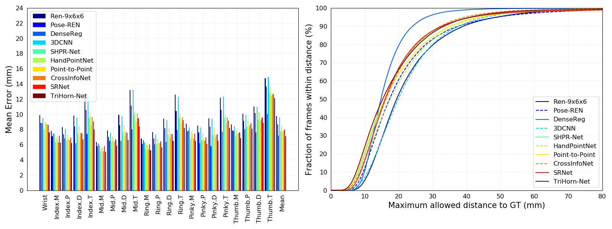

# Evaluations on hand pose estimation

## Description
This project provides codes to evaluate performances of hand pose estimation on several public datasets, including [NYU](http://cims.nyu.edu/~tompson/NYU_Hand_Pose_Dataset.htm), [ICVL](https://labicvl.github.io/hand.html), [MSRA](https://github.com/geliuhao/CVPR2016_HandPoseEstimation/issues/4) hand pose dataset. We collect predicted labels of some prior work **_which are available online_** and visualize the performances.

## Evaluation metric
There are two types of evaluation metrics that are widely used for hand pose estimation:

(1) Mean error for each joint

(2) Success rate:
 - The proportion of test frames whose average error falls below a threshold
 - The proportion of test frames whose maximum error falls below a threshold
 - The proportion of all joints whose error falls below a threshold

## Methods and corresponding predicted labels
### ICVL
- LRF \[1\]: CVPR'14, [Predicted labels](https://imperialcollegelondon.app.box.com/s/xivvoc1njhop2wjpt05z5z5ol0gwi0vw)
- DeepModel \[2\]: IJCAI'16, [Predicted labels](http://xingyizhou.xyz/IJCAI16_ICVL.txt)
- Guo-Baseline \[3\]: ICIP'17, [Predicted labels](https://github.com/guohengkai/region-ensemble-network/blob/master/results/icvl_basic.txt)
- REN-4x6x6 \[3\]: ICIP'17, [Predicted labels](https://github.com/guohengkai/region-ensemble-network/blob/master/results/icvl_ren_4x6x6.txt)
- REN-9x6x6 \[7\]: JVCI'18, [Predicted labels](https://github.com/guohengkai/region-ensemble-network/blob/master/results/icvl_ren_9x6x6.txt)
- Pose-REN \[8\]: NEUCOM'18, [Predicted labels](https://github.com/xinghaochen/awesome-hand-pose-estimation/tree/master/evaluation/results/icvl/NEUCOM18_ICVL_Pose_REN.txt)
- DenseReg \[10\]: CVPR'18, [Predicted labels](https://github.com/melonwan/denseReg/blob/master/exp/result/icvl.txt)
- V2V-PoseNet \[12\]: CVPR'18, [Predicted labels](http://cv.snu.ac.kr/research/V2V-PoseNet/ICVL/coordinate/result.txt)
- SHPR-Net \[14\]: Access'18, [Predicted labels](https://github.com/xinghaochen/awesome-hand-pose-estimation/tree/master/evaluation/results/icvl/Access18_ICVL_SHPR_Net.txt)
- HandPointNet \[15\]: CVPR'18, [Predicted labels](https://drive.google.com/file/d/1hYsgLvpuKpWpBkVzrIdCetJPWzGCtooB/view)
- Point-to-Point \[16\]: ECCV'18, [Predicted labels](https://drive.google.com/file/d/1hvAf7iee7bysDi26639qP9LfvucXBcTM/view)
- CrossInfoNet \[19\]: CVPR'19, [Predicted labels](https://github.com/dumyy/handpose/blob/master/results/CVPR19_ICVL_CrossInfoNet.txt)
- TriHorn-Net \[22\]: ArXiv'22, [Predicted labels](https://drive.google.com/file/d/1QqZbQS8wqxxahbmOgQHBWK59lGl7zXnU/view?usp=sharing)


### NYU
- DeepPrior \[4\]: CVWW'15, [Predicted labels](https://www.tugraz.at/fileadmin/user_upload/Institute/ICG/Downloads/team_lepetit/3d_hand_pose/CVWW15_NYU_Prior.txt)
- DeepPrior-Refinement \[4\]: CVWW'15, [Predicted labels](https://www.tugraz.at/fileadmin/user_upload/Institute/ICG/Downloads/team_lepetit/3d_hand_pose/CVWW15_NYU_Prior-Refinement.txt)
- Feedback \[5\]: CVPR'15, [Predicted labels](https://www.tugraz.at/fileadmin/user_upload/Institute/ICG/Downloads/team_lepetit/3d_hand_pose/ICCV15_NYU_Feedback.txt)
- DeepModel \[2\]: IJCAI'16, [Predicted labels](http://xingyizhou.xyz/IJCAI16_NYU.txt)
- Lie-X \[6\]: IJCV'16, [Predicted labels](https://web.bii.a-star.edu.sg/archive/machine_learning/Projects/behaviorAnalysis/Lie-X/Lie-X/lie_hand_jnts_estm_result.txt)
- Guo-Baseline \[3\]: ICIP'17, [Predicted labels](https://github.com/guohengkai/region-ensemble-network/blob/master/results/nyu_basic.txt)
- REN-4x6x6 \[3\]: ICIP'17, [Predicted labels](https://github.com/guohengkai/region-ensemble-network/blob/master/results/nyu_ren_4x6x6.txt)
- REN-9x6x6 \[7\]: JVCI'18, [Predicted labels](https://github.com/guohengkai/region-ensemble-network/blob/master/results/nyu_ren_9x6x6.txt)
- Pose-REN \[8\]: NEUCOM'18, [Predicted labels](https://github.com/xinghaochen/awesome-hand-pose-estimation/tree/master/evaluation/results/nyu/arXiv17_NYU_Pose_REN.txt)
- DeepPrior++ \[9\]: ICCVW'17, [Predicted labels](https://www.tugraz.at/fileadmin/user_upload/Institute/ICG/Downloads/team_lepetit/3d_hand_pose/ICCVW17_NYU_DeepPrior__.txt)
- DenseReg \[10\]: CVPR'18, [Predicted labels](https://github.com/melonwan/denseReg/blob/master/exp/result/nyu.txt)
- 3DCNN \[11\]: CVPR'17, [Predicted labels](https://drive.google.com/file/d/1M1iZyPZ3jU1_KIH0kJKvg1TwolpwLQxy/view?usp=sharing)
- V2V-PoseNet \[12\]: CVPR'18, [Predicted labels](http://cv.snu.ac.kr/research/V2V-PoseNet/NYU/coordinate/result.txt)
- FeatureMapping \[13\]: CVPR'18, [Predicted labels](https://www.tugraz.at/fileadmin/user_upload/Institute/ICG/Downloads/team_lepetit/FeatureMapping/CVPR18_NYU_DeepPrior___FM.txt.zip)
- SHPR-Net \[14\]: Access'18, [Predicted labels](https://github.com/xinghaochen/awesome-hand-pose-estimation/tree/master/evaluation/results/nyu/Access18_NYU_SHPR_Net_frontal.txt)
- SHPR-Net (three views) \[14\]: Access'18, [Predicted labels](https://github.com/xinghaochen/awesome-hand-pose-estimation/tree/master/evaluation/results/nyu/Access18_NYU_SHPR_Net_three.txt)
- HandPointNet \[15\]: CVPR'18, [Predicted labels](https://drive.google.com/file/d/1hYsgLvpuKpWpBkVzrIdCetJPWzGCtooB/view)
- Point-to-Point \[16\]: ECCV'18, [Predicted labels](https://drive.google.com/file/d/1hvAf7iee7bysDi26639qP9LfvucXBcTM/view)
- MURAUER \[17\]: WACV'19, [Predicted labels](https://github.com/poier/murauer/blob/master/results/joint_pos_murauer_n72757_wacv_uvd.txt)
- Generalized-Feedback \[18\]: TPAMI'19, [Predicted labels](https://www.tugraz.at/fileadmin/user_upload/Institute/ICG/Downloads/team_lepetit/3d_hand_pose/PAMI19_NYU_FB.txt)
- CrossInfoNet \[19\]: CVPR'19, [Predicted labels](https://github.com/dumyy/handpose/blob/master/results/CVPR19_NYU_CrossInfoNet.txt)
- DeepHPS \[20\]: 3DV'18, [Predicted labels](https://cloud.dfki.de/owncloud/index.php/s/5RZomRooZBxgAox)
- WHSP-Net \[21\]: Sensors'19, [Predicted labels](https://cloud.dfki.de/owncloud/index.php/s/5QeDcAECCMGj3gB?path=%2FNYUPose)
- TriHorn-Net \[22\]: ArXiv'22, [Predicted labels](https://drive.google.com/file/d/11wLja_Xvu6knqdIctd_fpM3aYeeLtuSc/view?usp=sharing)


### MSRA
- REN-9x6x6 \[7\]: JVCI'18, [Predicted labels](https://github.com/guohengkai/region-ensemble-network/blob/master/results/msra_ren_9x6x6.txt)
- Pose-REN \[8\]: NEUCOM'18, [Predicted labels](https://github.com/xinghaochen/awesome-hand-pose-estimation/tree/master/evaluation/results/msra/arXiv17_MSRA_Pose_REN.txt)
- DenseReg \[10\]: CVPR'18, [Predicted labels](https://github.com/melonwan/denseReg/blob/master/exp/result/msra.txt)
- 3DCNN \[11\]: CVPR'17, [Predicted labels](https://drive.google.com/file/d/1M1iZyPZ3jU1_KIH0kJKvg1TwolpwLQxy/view?usp=sharing)
- SHPR-Net \[14\]: Access'18, [Predicted labels](https://github.com/xinghaochen/awesome-hand-pose-estimation/tree/master/evaluation/results/msra/Access18_MSRA_SHPR_Net.txt)
- HandPointNet \[15\]: CVPR'18, [Predicted labels](https://drive.google.com/file/d/1hYsgLvpuKpWpBkVzrIdCetJPWzGCtooB/view)
- Point-to-Point \[16\]: ECCV'18, [Predicted labels](https://drive.google.com/file/d/1hvAf7iee7bysDi26639qP9LfvucXBcTM/view)
- CrossInfoNet \[19\]: CVPR'19, [Predicted labels](https://github.com/dumyy/handpose/blob/master/results/CVPR19_MSRA_CrossInfoNet.txt)
- TriHorn-Net \[22\]: ArXiv'22, [Predicted labels](https://drive.google.com/file/d/1T5nN_CK9qD5y1iSCapt2oyuMugLi4buQ/view?usp=sharing)


[\[back to top\]](#evaluations-on-hand-pose-estimation)

### Notes
- Note that only 14 out of 36 joints are used for evaluation and we use the joints with id [0, 3, 6, 9, 12, 15, 18, 21, 24, 25, 27, 30, 31, 32]. All labels are in the format of (u, v, d) where u and v are pixel coordinates.

- **The code to plot errors over different yaw and pitch angles for MSRA is still under construction and needs further improvement. Stay tuned.**

- For [Lie-X](https://web.bii.a-star.edu.sg/archive/machine_learning/Projects/behaviorAnalysis/Lie-X/Lie-X.html), the original predicted labels are in format of (x, y, z) and the order of joints is different. We convert the labels from xyz to uvd and permute the order of joints to keep consistent with other methods (see src/convert_results_xyz2uvd_LieX.py).

- For [DenseReg](https://github.com/melonwan/denseReg), we convert the original predicted labels from xyz to uvd (see src/convert_results_xyz2uvd_denseReg.py).

- Since [DeepPrior[4]](https://www.tugraz.at/institute/icg/teams/teamlepetit/research/hand-detection-and-3d-pose-estimation/) and [DeepPrior++[9]](https://www.tugraz.at/institute/icg/teams/teamlepetit/research/hand-detection-and-3d-pose-estimation/) only provide predicted labels of Sequence A (702 frames) for ICVL dataset (totally 1596 frames for two test sequences), we haven't included these method in comparisons for ICVL dataset yet.

- [DeepPrior++[9]](https://www.tugraz.at/institute/icg/teams/teamlepetit/research/hand-detection-and-3d-pose-estimation/) also provides predicted labels of for MSRA dataset online. However, the results seem to be shuffled so we haven't included these results yet, stay tuned.

- For [3DCNN](https://sites.google.com/site/geliuhaontu/home/cvpr2017), [HandPointNet](https://sites.google.com/site/geliuhaontu/home/cvpr2018) and [Point-to-Point](https://sites.google.com/site/geliuhaontu/home/eccv2018),  we convert the original predicted labels from xyz to uvd (see src/convert_results_xyz2uvd_Ge.py).

- The annotations for MSRA dataset for [V2V-PoseNet](http://cv.snu.ac.kr/research/V2V-PoseNet/MSRA/coordinate/result.txt) are slightly different from prior work (see the discussions [here](https://github.com/xinghaochen/awesome-hand-pose-estimation/issues/2)) so we haven't included its results yet.

[\[back to top\]](#evaluations-on-hand-pose-estimation)

## Usage
Use the python code to show the evaluation results:
```
python compute_error.py icvl/nyu/msra max-frame/mean-frame/joint method_names in_files
```
The first parameter indicates which dataset is being evaluated while the second one indicates which type of success rate that is listed above is being chosen. The following parameters specify the names of methods and their corresponding predict label files.

We provide easy-to-use bash scripts to display performances of some methods, just run the following command:
```
sh evaluate_{dataset}.sh
```

[\[back to top\]](#evaluations-on-hand-pose-estimation)

## Results
### Results on NYU dataset


|Methods|3D Error (mm)|
|------|------|
| DeepPrior [4] | 20.750 |
| DeepPrior-Refine [4] | 19.726 |
| DeepModel [2] |17.036  |
| Feedback [5] |15.973  |
|  Guo_Baseline [3] |14.588 |
|  Lie-X [6] | 14.507 |
|  DeepHPS [20] | 14.415 |
|  3DCNN [11] |14.113 |
|  REN-4x6x6 [3] | 13.393  |
|  REN-9x6x6 [7] | 12.694  |
|  DeepPrior++ [9] |12.238 |
|  Pose-REN [8] | 11.811  |
|  Generalized-Feedback [18] | 10.894 |
|  SHPR-Net [14] | 10.775 |
|  HandPointNet [15] | 10.540  |
|  DenseReg [10] | 10.214 |
|  CrossInfoNet [19] | 10.078 |
|  MURAUER [17] | 9.466 |
|  WHSP-Net [21] | 9.421 |
|  SHPR-Net (three views) [14] | 9.371 |
|  Point-to-Point [16] | 9.045  |
|  V2V-PoseNet [12] |8.419  |
|  TriHorn-Net [22] |7.68  |
|  FeatureMapping [13] | 7.441  |

[\[back to top\]](#evaluations-on-hand-pose-estimation)

### Results on ICVL dataset


|Methods|3D Error (mm)|
|------|------|
|  LRF [1] | 12.578 |
| DeepModel [2] | 11.561 |
|  Guo_Baseline [3] | 8.358 |
|  REN-4x6x6 [3] | 7.628  |
|  REN-9x6x6 [7] | 7.305  |
|  DenseReg [10] | 7.239 |
|  SHPR-Net [14] | 7.219 |
|  HandPointNet [15] | 6.935  |
|  Pose-REN [8] | 6.791  |
|  CrossInfoNet [19] | 6.732 |
|  Point-to-Point [16] | 6.328  |
|  V2V-PoseNet [12] | 6.284  |
|  TriHorn-Net [22] |5.73  |


[\[back to top\]](#evaluations-on-hand-pose-estimation)

### Results on MSRA dataset


|Methods|3D Error (mm)|
|------|------|
|  REN-9x6x6 [7] | 9.792  |
|  3DCNN [11] | 9.584  |
|  Pose-REN [8] | 8.649  |
|  HandPointNet [15] | 8.505  |
|  CrossInfoNet [19] | 7.862 |
|  SHPR-Net [14] | 7.756 |
|  Point-to-Point [16] | 7.707  |
|  DenseReg [10] | 7.234 |
|  TriHorn-Net [22] |7.13  |


[\[back to top\]](#evaluations-on-hand-pose-estimation)

### Results on HANDS17 challenge dataset

See leaderboard [here](https://competitions.codalab.org/competitions/17356#results) for sequence based (tracking) and frame based hand pose estimation task.

See leaderboard [here](https://competitions.codalab.org/competitions/17452#results) for hand-object interaction hand pose estimation task.

[\[back to top\]](#evaluations-on-hand-pose-estimation)

## Reference
- \[1\] [Latent regression forest: Structured estimation of 3d articulated hand posture](https://labicvl.github.io/docs/pubs/Danny_CVPR_2014.pdf), Danhang Tang, Hyung Jin Chang, Alykhan Tejani, and Tae-Kyun Kim, **CVPR** 2014.
- \[2\] [Model-based Deep Hand Pose Estimation.](http://xingyizhou.xyz/zhou2016model.pdf), Xingyi Zhou, Qingfu Wan, Wei Zhang, Xiangyang Xue, and Yichen Wei, **IJCAI**, 2016.
- \[3\] [Region Ensemble Network: Improving Convolutional Network for Hand Pose Estimation.](https://arxiv.org/pdf/1702.02447.pdf), Hengkai Guo, Guijin Wang, Xinghao Chen, Cairong Zhang, Fei Qiao, and Huazhong Yang, **ICIP** 2017.
- \[4\] [Hands Deep in Deep Learning for Hand Pose Estimation.](https://arxiv.org/pdf/1502.06807), Markus Oberweger, Paul Wohlhart, and Vincent Lepetit, **CVWW** 2015.
- \[5\] [Training a Feedback Loop for Hand Pose Estimation.](https://arxiv.org/pdf/1609.09698), Markus Oberweger, Paul Wohlhart, and Vincent Lepetit, **ICCV** 2015.
- \[6\] [Lie-X: Depth Image Based Articulated Object Pose Estimation, Tracking, and Action Recognition on Lie Groups.](https://arxiv.org/pdf/1609.03773), Chi Xu, Lakshmi Narasimhan Govindarajan, Yu Zhang, and Li Cheng, **IJCV** 2017.
- \[7\] [Region Ensemble Network: Towards Good Practices for Deep 3D Hand Pose Estimation.](https://www.sciencedirect.com/science/article/pii/S1047320318300816), Guijin Wang, Xinghao Chen\*, Hengkai Guo\*, Cairong Zhang, **JVCI** 2018.
- \[8\] [Pose Guided Structured Region Ensemble Network for Cascaded Hand Pose Estimation.](https://arxiv.org/pdf/1708.03416), Xinghao Chen, Guijin Wang, Hengkai Guo, and Cairong Zhang, **Neurocomputing** 2018.
- \[9\] [DeepPrior++: Improving Fast and Accurate 3D Hand Pose Estimation.](https://www.tugraz.at/fileadmin/user_upload/Institute/ICG/Images/team_lepetit/publications/oberweger_iccvw17.pdf), Markus Oberweger, and Vincent Lepetit, **ICCVW** 2017.
- \[10\] [Dense 3D Regression for Hand Pose Estimation.](https://arxiv.org/pdf/1711.08996.pdf), Chengde Wan, Thomas Probst, Luc Van Gool, and Angela Yao, **CVPR** 2018.
- \[11\] [3D Convolutional Neural Networks for Efficient and Robust Hand Pose Estimation from Single Depth Images](https://drive.google.com/open?id=0B5nUFeZt3D19bzR3NXNURHc0Rkk), Liuhao Ge, Hui Liang, Junsong Yuan and Daniel Thalmann, **CVPR** 2017.
- \[12\] [V2V-PoseNet: Voxel-to-Voxel Prediction Network for Accurate 3D Hand and Human Pose Estimation from a Single Depth Map](https://arxiv.org/pdf/1711.07399.pdf), Gyeongsik Moon, Ju Yong Chang, Kyoung Mu Lee, **CVPR** 2018.
- \[13\] [Feature Mapping for Learning Fast and Accurate 3D Pose Inference from Synthetic Images](https://arxiv.org/pdf/1712.03904.pdf), Mahdi Rad, Markus Oberweger, Vincent Lepetit, **CVPR** 2018.
- \[14\] [SHPR-Net: Deep Semantic Hand Pose Regression From Point Clouds](https://ieeexplore.ieee.org/stamp/stamp.jsp?tp=&arnumber=8425735&tag=1), Xinghao Chen, Guijin Wang, Cairong Zhang, Tae-Kyun Kim, Xiangyang Ji, **IEEE Access** 2018.
- \[15\] [Hand PointNet: 3D Hand Pose Estimation using Point Sets](http://openaccess.thecvf.com/content_cvpr_2018/papers/Ge_Hand_PointNet_3D_CVPR_2018_paper.pdf), Liuhao Ge, Yujun Cai, Junwu Weng, Junsong Yuan, **CVPR** 2018.
- \[16\] [Point-to-Point Regression PointNet for 3D Hand Pose Estimation](http://openaccess.thecvf.com/content_ECCV_2018/papers/Liuhao_Ge_Point-to-Point_Regression_PointNet_ECCV_2018_paper.pdf), Liuhao Ge, Zhou Ren, Junsong Yuan, **ECCV** 2018.
- \[17\] [MURAUER: Mapping Unlabeled Real Data for Label AUstERity](https://arxiv.org/pdf/1811.09497.pdf), Georg Poier, Michael Opitz, David Schinagl and Horst Bischof, **WACV** 2019.
- \[18\] [Generalized Feedback Loop for Joint Hand-Object Pose Estimation](https://arxiv.org/pdf/1903.10883), Markus Oberweger, Paul Wohlhart, Vincent Lepetit, **TPAMI** 2019.
- \[19\] [CrossInfoNet: Multi-Task Information Sharing Based Hand Pose Estimation](#), Kuo Du, Xiangbo Lin, Yi Sun, Xiaohong Ma, **CVPR** 2019.
- \[20\] [DeepHPS: End-to-end Estimation of 3D Hand Pose and Shape by Learning from Synthetic Depth](https://arxiv.org/pdf/1808.09208.pdf), Jameel Malik, Ahmed Elhayek, Fabrizio Nunnari, Kiran Varanasi, Kiarash Tamaddon, Alexis Heloir, Didier Stricker, **3DV** 2018.
- \[21\] [WHSP-Net: A Weakly-Supervised Approach for 3D Hand Shape and Pose Recovery from a Single Depth Image](https://www.mdpi.com/1424-8220/19/17/3784), Jameel Malik, Ahmed Elhayek, Didier Stricker, **Sensors** 2019.
- \[22\] [TriHorn-Net: A Model for Accurate Depth-Based 3D Hand Pose Estimation](https://arxiv.org/abs/2206.07117), Mohammad Rezaei, Razieh Rastgoo and Vassilis Athitsos, arXiv 2022.

[\[back to top\]](#evaluations-on-hand-pose-estimation)

